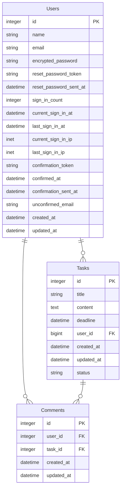

# ER 図

参考:https://mermaid-js.github.io/mermaid/#/entityRelationshipDiagram

```mermaid
erDiagram
    Users ||--o{ Comments : ""
    Users ||--o{ Tasks : ""
    Tasks ||--o{ Comments : ""

    Users {
      integer id PK
      string name
      string email
      string encrypted_password
      string reset_password_token
      datetime reset_password_sent_at
      integer sign_in_count
      datetime current_sign_in_at
      datetime last_sign_in_at
      inet current_sign_in_ip
      inet last_sign_in_ip
      string confirmation_token
      datetime confirmed_at
      datetime confirmation_sent_at
      string unconfirmed_email
      datetime created_at
      datetime updated_at
    }

    Tasks {
      integer id PK
      string title
      text content
      datetime deadline
      bigint user_id FK
      datetime created_at
      datetime updated_at
      string status
    }

    Comments {
      integer id PK
      integer user_id FK
      integer task_id FK
      datetime created_at
      datetime updated_at
    }
```
